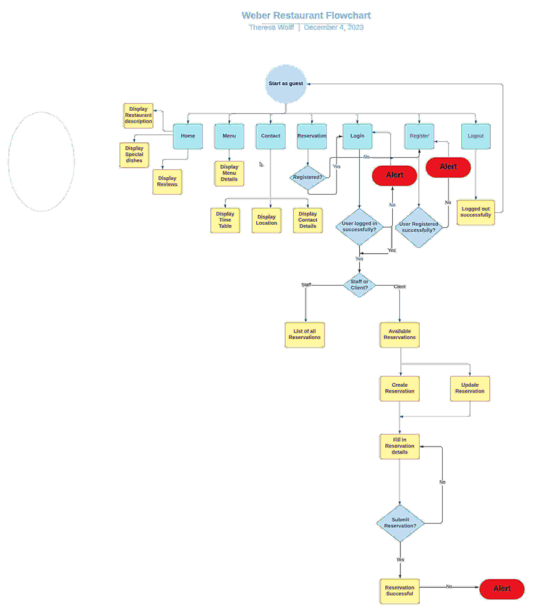

# Weber Restaurant - Booking Website

(Developer: Theresa Wolff)

**Live Site:**

[Live webpage]()

**Link to Repository:**

[Repository]()

**Developed by: Theresa Wolff**

## Table of Content

* [The Weber Restaurant-Booking Website](#the-weber-restaurant-booking-website)
* [Table of Content](#table-of-content)
* [Overview](#overview)
* [User Experience - UX](#user-experience---ux)
  + [Strategy](#strategy)
  + [Scope](#scope)
  + [Structure](#structure)
  + [Skeleton](#skeleton)
  + [Surface](#surface)
    - [Color Scheme](#color-scheme)
    - [Fonts](#fonts)
    - [Visual Effects](#visual-effects)
* [Agile Methodology](#agile-methodology)
* [Features](#features)
  + [Existing Features](#existing-features)
    - [Create bookings](#create-bookings)
    - [Menu](#menu)
    - [Client booking management](#client-bookings-management)
    - [Staff bookings management](#staff-bookings-management)
    - [Contact](#contact)
  + [Future Feature Considerations](#future-feature-considerations)
* [Responsive Layout and Design](#responsive-layout-and-design)
* [Technologies Used](#technologies-used)
  + [Languages](#languages)
  + [Python packages](#python-packages)
  + [Frameworks \& Tools](#frameworks--tools)
* [Testing and Validation](#testing-and-validation)
* [Deployment \& Development](#deployment--development)
  + [Deploy on heroku](#deploy-on-heroku)
  + [FORK THE REPOSITORY](#fork-the-repository)
  + [CLONE THE REPOSITORY](#clone-the-repository)
* [Credits](#credits)
  + [Media](#media)
  + [Code](#code)
* [Acknowledgements](#acknowledgements)

## Overview
Weber Restaurant is a fictional restaurant located in the heart of Munich's English Garden, Germany. The project is designed to create a comprehensive experience for Weber Restaurant's clients. The users can easily reserve tables,  add special notes for the booking, and specify the number of guests. On the other hand, staff members can manage these bookings efficiently through a staff-only interface. The system ensures that only available tables are offered to the customers, considering variables like time, date, and capacity. The website was created to handle real-world scenarios with ease. Weber Restaurant's booking website was developed using Python(Django), HTML, CSS, and JavaScript, with data being stored in a PostgreSQL database and images on a WhiteNoise.
  
The fully deployed project can be accessed at [this link](https://.herokuapp.com/).  

## User Experience - UX
This site was created respecting the Five Planes Of Website Design: 
### Strategy

**User Stories:**  

|   EPIC                                |ID|                                User Story                                                   |
| :-------------------------------------|--|:------------------------------------------------------------------------------------------- |
|**CONTENT AND NAVIGATION**             |  ||
|                                       |1A| As a user, I want to see a menu so I can easily navigate through website content |             
|                                       |1B| As a user, I want to see relevant information about the restaurant|
|                                       |1C| As a user, I want the website to have a nice and intuitive design that will match the restaurant's theme|
|**USER REGISTRATION/AUTENTHICATION**                     |  ||
|                                       |2A| As a  user,  I want to create an account so that I can make reservations in my name|
|                                       |2B| As a  user, I want to use my email and password to log in so that my account is secure|
|                                       |2C| As a user, I want to log in from my account so that I can keep my account safe|
|                                       |2D| As a user, I want to reset my password by sending a link so that I can log in even if I forgot my password|
|**CONTACT**                            |  ||
|                                       |3A| As a user, I want to see the restaurant's opening and closing hours|
|                                       |3B| As a user, I want to see location information on the website|
|                                       |3C| As a user, I want to see contact information on the website|
|                                       |3D| As a user, I want to see relevant information on the website|
|**MENU**                               |  ||
|                                       |4A| As a user, I want to see the restaurant's menu with details about ingredients and prices so that I can be completely aware of everything I want to order|
|**BOOKINGS**                           |  ||
|                                       |5A| As a logged-in user, I can see a list of my reservations so that I can have a better overview|
|                                       |5B| As a logged-in staff member, I can see upcoming reservations so that we can prepare for the working day|
|                                       |5C| As a logged-in staff member, I can filter reservations so that I can see reservations for a specific date|
|                                       |5D| As a logged-in user, I can update a selected reservation so that I can choose a more convenient time|
|                                       |5E| As a logged-in staff member, I can update a selected reservation to help clients|X
|                                       |5F| As a logged-in user, I can delete reservations so that I have control over my bookings|
|                                       |5G| As a logged-in staff member, I can cancel bookings so that I can help a client with the cancellation|
|                                       |5H| As a logged-in user, I can select a time and date to finalize my reservation|
|                                       |5I| As a logged-in user, I can see available tables for a specific date and time so that I can easily decide where to sit|
|                                       |5J| As a site user, I get a confirmation email when making a reservation so that the risk of becoming a no-show-reservation is minimized |
|**STAND ALONE PAGES**                  |  ||
|                                       |6A| As a developer, I need to implement a 404 error page to alert users when they have accessed a page that doesn't exist|
|                                       |6B| As a developer, I need to implement a 500 error page to alert users when an internal server error occurs|
|                                       |6C| As a developer, I need to implement a 403 error page to redirect unauthorized users so that I can secure my views|
|                                       |6D| As a restaurant owner, I would like a home page so that customers can view information on my restaurant|
|**DEPLOYMENT**                         |  ||
|                                       |7A| As a developer, I need to remove comments and turn off DEBUG so that my project is ready for final deployment|
|                                       |7B| As a developer, I need to deploy the project to Heroku so that it is live for customers|
|**DOCUMENTATION**                      |  ||
|                                       |8A| As a developer, I need to write automated tests and testing documentation so that others and myself can better understand my project|
|                                       |8B| As a developer, I need to write a readme.md so that others and I can better understand my project|

**Project Goal:** 
This project aims to create a website for the Weber Restaurant that is useful and ensures efficient management for staff members and an engaging experience for clients.

**Project Objectives:** 
* To create a  website  with a simple and intuitive User Experience;
* To make a responsive website that works on every device;
* To add content that is relevant and helps create a better image of the restaurant;
* To make clear categories of login accounts for staff members and clients;
* To implement fully functional features that will ease the staff members' tasks and upgrade clients' experience with the restaurant services;
* To present the restaurant's menu visually appealing and informatively, providing details about ingredients, prices, and any particular dishes;
* To ensure the security and privacy of user data, especially regarding personal information and reservation details;
* To maintain consistency with the brand identity of Weber Restaurant in terms of colors, fonts, and overall visual style.  

### Scope

**Simple and Intuitive User Experience** 
* Create a design that aligns with the restaurant's theme and branding;
* Create a clear and well-organized header and footer design;
* Ensure the navigation menu is prominently displayed and remains functional at every step of the user journey;
* Ensure each page has a suggestive name that reflects its content;
* Create visual feedback mechanisms to inform users as they navigate through different pages;
* Organize content logically, making relevant information easily accessible to users;
* Create prominent and clear call-to-action buttons, guiding users to essential functions like making reservations and viewing the menu.

**Relevant Content** 
* Add relevant information about the restaurant, such as the restaurant's name, precise location, contact phone number, and email address;
* Create a clear and attractive presentation of the restaurant menu;
* Create the culinary delights of Weber Restaurant through high-quality and appetizing photos.

**Features for Upgraded Experience** 
* Create an intuitive reservation system enabling users to view and select available tables for specific dates and times:
* Create a Menu feature that provides information about each dish, including ingredients and pricing;
* Create a Profile page where customers can track their upcoming reservations and manage their favorite meals;
* Create a staff-member account system with specialized privileges for managing all bookings for all the users.

**Clients and Staff Members Different Accounts** 
* Allow access to a personalized profile page for client types of users where they can view and manage their reservations, favorite meals, and dining preferences;
* Allow access to the Manage Bookings page, which enables staff members to handle reservations efficiently, update table availability, and provide excellent customer service;
* Create a filter function within the staff-member dashboard to quickly locate and manage specific reservations;
* Allow the client to add and edit meal reviews and overall dining experiences.

**Responsiveness** 
* Create a responsive website that adapts to various devices, including desktops, laptops, tablets, and smartphones. 

### Structure

The website is created and designed to focus on user experience and is divided into seven distinct pages, each crafted to fulfill a specific function. The content on these pages dynamically adapts depending on the user's authentication status and roles as either a client or staff member. Here are the details:
* **Register/Login:** pages allow users to create accounts and authenticate for accessing personalized features. 
* **Logout:** This page implements a modal for users to securely log out of their account and ensure a user-friendly experience when exiting the current session.
* **Home page:** The page is accessible to both client and staff users and includes restaurant details, special dishes, and reviews. A call to action to encourage users to make a reservation like  Book a Table.  It also provides a welcoming overview of the restaurant for all visitors.
* **Menu:** The page is open to all users and displays the restaurant's menu items. An "Add to Favourite" feature is available only to logged-in clients.
* **Reservations/Profile:** Exclusive to authenticated users (clients and staff). This page enables authenticated users to make or manage bookings and provides a personalized space for users to handle their reservations and account details.
* **Contact:** contains information visible to all users and provides details on the restaurant's location, opening & closing times, and contact information for easy access.
* **Staff Manage Bookings:** Limited to staff members only and exclusively accessible to staff members. This page displays a comprehensive view of all registered bookings, offering tools for efficient management through grouping and filtering by date.

#### Flowchart
The Flowchart for my program was designed using <b>LucidChart</b>. It visualizes the system's work, providing an overview of the logic and steps involved in the program's workflow. 
  

### Skeleton

**Wireframes** 
The wireframes for mobile and desktop were created with  [Balsamiq](https://balsamiq.com/) tool and can be viewed [here]

